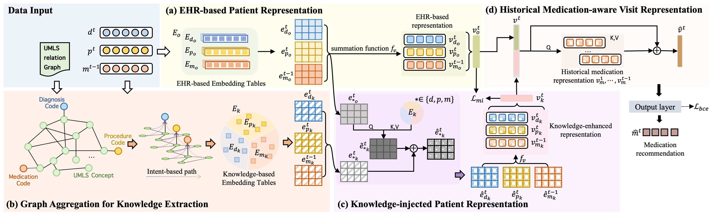

# DKINet

This repository provides the code for **DKINet:Medication Recommendation via Domain Knowledge Informed Deep Learning**

# Overview



# Dataset
MIMIC-III: Download from [https://physionet.org/content/mimiciii/1.4/](https://physionet.org/content/mimiciii/1.4/)

MIMIC-IV: Download from [ https://physionet.org/content/mimiciv/](https://physionet.org/content/mimiciv/)

eICU: Download from [https://eicu-crd.mit.edu/about/eicu/](https://eicu-crd.mit.edu/about/eicu/)


### Data Preprocessing

For a fair comparision, we used the data pre-processing of [DrugRec](https://github.com/ssshddd/DrugRec). We thank the authors for their open-sourced code and encourage users to cite their works when applicable.

# Environment

Please create the conda environment through yaml file
```
conda env create -f environment.yml
```

Please note that we trained our code on the Linux platform.

# Run the code
```
python src/mimic-iv-main.py
```
